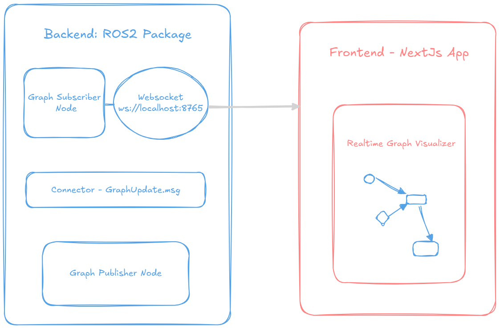
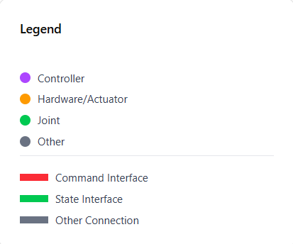
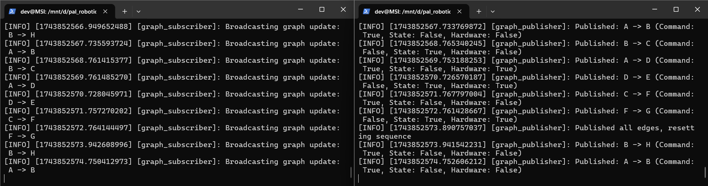
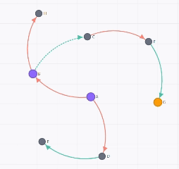
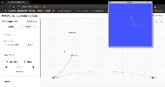

<!-- PROJECT LOGO -->
<div align="center">

  <h3 align="center">ROS 2 Control Ecosystem Visualization</h3>

  <p align="center">
   Visualize Nodes in a intutive Directed Acyclic Graph format - Get realtime updates
    <br />
    <a href="https://ros-control-viz.vercel.app/">Try Demo</a>
  </p>
  
  <!-- Added Demo GIF placeholder -->
  
  <p><em>Demo: Real-time visualization of ROS 2 control system</em></p>
</div>
 
<!-- TABLE OF CONTENTS -->
<details>
  <summary>Table of Contents</summary>
  <ol>
    <li>
      <a href="#about-the-project">About The Project</a>
      <ul>
        <li><a href="#built-with">Built With</a></li>
      </ul>
    </li>
    <li>
      <a href="#getting-started">Getting Started</a>
      <ul>
        <li><a href="#prerequisites">Prerequisites</a></li>
        <li><a href="#installation">Installation</a></li>
      </ul>
    </li>
    <li><a href="#usage">Usage</a></li>
    <li><a href="#roadmap">Roadmap</a></li>
    <li><a href="#contributing">Contributing</a></li>
    <li><a href="#license">License</a></li>
    <li><a href="#contact">Contact</a></li>
    <li><a href="#acknowledgments">Acknowledgments</a></li>
  </ol>
</details>

<!-- ABOUT THE PROJECT -->

## About The Project

This project is a ROS 2-based Directed Acyclic Graph (DAG) visualizer that subscribes to a custom topic, processes incoming messages, and updates a graph dynamically. The graph is interactive, displays metadata, and distinguishes edges based on the message attributes.

<!-- Added System Architecture Diagram placeholder -->
<div align="center">
  
  <p><em>System Architecture: How the ROS 2 nodes interact with the web interface</em></p>
</div>

### Built With

- 
- 
- 
- 
- 
- 
- 

## Features

- **ROS 2 Subscription & Service Call**: A ROS 2 node subscribes to a topic and sends a service request.
- **Custom Message Definition**: Implements a custom message format for defining directed edges.
- **TypeScript-based Graph Visualization**: The DAG is displayed using TypeScript, earning extra points for interactivity and metadata display.
- **Dynamic Graph Updates**: Graph updates in real-time based on received ROS messages.
- **Metadata Display**: Each node contains metadata information for better visualization.
- **Edge Coloring Rules**:
  - **Command interface (`command_interface = true`)**: Edge is shown in a specific color.
  - **State interface (`state_interface = true`)**: Another distinct color.
  - **Hardware-based (`is_hardware = true`)**: Highlighted accordingly.

<!-- Added visualization features demonstration placeholder -->
<div align="center">
  
  <p><em>Visualization Features: Node metadata, edge coloring, and interactive elements</em></p>
</div>

## Custom Message Definition

This project defines a custom ROS 2 message type:

```msg
string start
string end
bool command_interface
bool state_interface
bool is_hardware
string metadata
```

<p align="right">(<a href="#readme-top">back to top</a>)</p>

<!-- GETTING STARTED -->

## Getting Started

### Prerequisites

- For ROS package

  - Install ROS2 - Jazzy ([Documentation](https://docs.ros.org/en/jazzy/Installation.html))
  - Clone and Setup ROS2 Workspace - [ros2-control-viz](https://github.com/Malay-dev/ros2-control-viz)

- For Web Interface
  - Node.js (LTS recommended)
  - `npm or yarn`
  - Clone and Setup Web Interface - [ros2_control_web](https://github.com/Malay-dev/ros2_control_web)
  - TurtleSim package (for the TurtleSim example)

### Setup Instructions for the web interface

1. **Clone the repository**

   ```bash
   git clone https://github.com/Malay-dev/ros2_control_web.git
   cd ros2_control_web
   ```

2. **Install dependencies**

   ```bash
   npm install
   ```

3. **Start the development server**

   ```bash
   npm run dev
   ```

4. **Access the web interface**
   - Open your browser and navigate to [http://localhost:3000](http://localhost:3000)
   - The interface will show "Disconnected" status initially

#### Connect to ROS2

1. **Set up the ROS2 backend**

   - Make sure you have installed and configured [ros2_control_viz](https://github.com/Malay-dev/ros2_control_viz)
   - Follow the instructions in the [ROS2 Package Setup](#setup-instructions-for-the-ros-package) section to start the backend

2. **Verify connection**
   - When the ROS2 backend is properly running, the web interface will automatically connect
   - Connection status will change to "Connected"
   - Control values will begin populating in real-time

### Setup Instructions for the ROS Package

#### Installing Dependencies

First, ensure you have all necessary dependencies:

```bash
# Install ROS 2 dependencies
sudo apt update
sudo apt install -y ros-jazzy-turtlesim

# Install Python dependencies
pip3 install websockets asyncio
```

#### Setting Up the Workspace

1. Create a new ROS 2 workspace or use an existing one:

```bash
# Create a new workspace (if needed)
mkdir -p ~/ros2_ws/src
cd ~/ros2_ws/src

# Clone the repository
git clone https://github.com/Malay-dev/ros2_control_viz.git
```

2. Build the workspace:

```bash
cd ~/ros2_ws
colcon build --symlink-install
```

3. Source the workspace:

```bash
source ~/ros2_ws/install/setup.bash
```

**Tip:** Add this line to your `~/.bashrc` file to automatically source the workspace in every new terminal:

```bash
echo "source ~/ros2_ws/install/setup.bash" >> ~/.bashrc
```

## Running Examples

### Basic Example

This example demonstrates the core functionality of publishing and subscribing to graph updates:

1. In one terminal, run the graph subscriber:

```bash
ros2 run ros2_control_viz graph_subscriber
```

2. In another terminal, run the graph publisher:

```bash
ros2 run ros2_control_viz graph_publisher
```

You should see output in the subscriber terminal showing the connections being published:

```
[INFO] [graph_subscriber]: Received: A -> B | Metadata: {"type": "controller", "priority": 1, "rate": "100Hz"}
[INFO] [graph_subscriber]: Received: B -> C | Metadata: {"type": "state_handler", "priority": 2, "status": "active"}
...
```

<!-- Added terminal output visualization placeholder -->
<div align="center">
  
  <p><em>Terminal Output: Subscriber (Left) receiving graph updates from publisher (Right)</em></p>
</div>

### Basic Example with Web Interface Visualization

This setup connects the graph publisher to a web interface for visual representation:

1. Start the WebSocket bridge server:

```bash
ros2 run ros2_control_viz web_socket_graph
```

2. In another terminal, run the graph publisher:

```bash
ros2 run ros2_control_viz graph_publisher
```

3. In a web browser, navigate to the web interface:
   - If using the hosted demo: [https://ros-control-viz.vercel.app/](https://ros-control-viz.vercel.app/)
   - If running locally: http://localhost:3000

You should see a live visualization of the graph with color-coded edges indicating command interfaces, state interfaces, and hardware components.

<!-- Added web interface visualization placeholder -->
<div align="center">
  
  <p><em>Live Graph: Dynamic visualization with color-coded edges and nodes</em></p>
</div>

**Visualization Legend:**

- <span style="display:inline-block;width:15px;height:15px;background-color:#9b4dca;"></span> `Controller`
- <span style="display:inline-block;width:15px;height:15px;background-color:#f59e0e;"></span> `Hardware/Actuator`
- <span style="display:inline-block;width:15px;height:15px;background-color:#10b981;"></span> `Joint`
- <span style="display:inline-block;width:15px;height:15px;background-color:#6b7280;"></span> `Other`
- <span style="display:inline-block;width:15px;height:15px;background-color:#f87171;"></span> `Command Interface`
- <span style="display:inline-block;width:15px;height:15px;background-color:#22c55e;"></span> `State Interface`
- <span style="display:inline-block;width:15px;height:15px;background-color:#6b7280;"></span> `Other Connection`
- `Solid Line` for edge
- `Dashed Line` for edge update

### TurtleSim Integration Example

This example visualizes the data flow between TurtleSim and teleop controls:

1. Start the WebSocket bridge server:

```bash
ros2 run ros2_control_viz web_socket_graph
```

2. In another terminal, start the TurtleSim node:

```bash
ros2 run turtlesim turtlesim_node
```

3. In another terminal, start the TurtleSim teleop:

```bash
ros2 run turtlesim turtle_teleop_key
```

4. In a fourth terminal, start the turtle graph publisher:

```bash
ros2 run ros2_control_viz turtle_graph_publisher
```

5. Open the web interface at http://localhost:3000 (or the hosted demo)

6. Use the arrow keys in the teleop terminal to control the turtle

<!-- Added TurtleSim integration animation placeholder -->
<div align="center">
  
  <p><em>TurtleSim Integration: Real-time visualization of turtle movement and control flow</em></p>
</div>

The visualization will update in real-time, showing:

- Commands flowing from the teleop to the turtle
- State information flowing from the turtle
- Metadata including position and velocity

## Troubleshooting

### Common Issues

1. **"Package 'ros2_control_viz' not found":**

   - Make sure you've built the workspace: `cd ~/ros2_ws && colcon build`
   - Ensure you've sourced the workspace: `source ~/ros2_ws/install/setup.bash`

2. **WebSocket connection issues:**

   - Check that the WebSocket server is running
   - Verify that port 8765 is not blocked by a firewall
   - Check the server logs for any connection errors

3. **No visualization in the web interface:**
   - Ensure the WebSocket server shows a "connected" status in the web interface
   - Verify that graph updates are being published (check the publisher terminal)
   - Try refreshing the web interface

## Publishing Custom Graph Updates

You can publish your own graph updates from the command line:

```bash
ros2 topic pub /graph_update ros2_control_viz_interfaces/msg/GraphUpdate '{start: "Custom1", end: "Custom2", command_interface: true, state_interface: false, is_hardware: true, metadata: "{\"description\": \"My custom connection\"}"}'
```

Note: Checkout [turtle_connector.py](https://github.com/Malay-dev/ros2-control-viz/blob/main/src/ros2_control_viz/ros2_control_viz/turtle_connector.py) for more info on how to translate your custom package msgs to [GraphUpdate.msg](https://github.com/Malay-dev/ros2-control-viz/blob/main/src/ros2_control_viz_interfaces/msg/GraphUpdate.msg)

<!-- ROADMAP -->

## Roadmap

- [x] Add Readme
- [ ] Stricter Type Checks
- [ ] User Interface/User Experience
- [ ] Dynamic Layout lags
- [ ] Research for better graph simulations
- [ ] Add More Example Connectors

See the [open issues](https://github.com/Malay-dev/ros2_control_web/issues) for a full list of proposed features (and known issues).

<p align="right">(<a href="#readme-top">back to top</a>)</p>

<!-- CONTRIBUTING -->

## Contributing

Contributions are what make the open source community such an amazing place to learn, inspire, and create. Any contributions you make are **greatly appreciated**.

If you have a suggestion that would make this better, please fork the repo and create a pull request. You can also simply open an issue with the tag "enhancement".
Don't forget to give the project a star⭐! Thanks again!

1. Fork the Project
2. Create your Feature Branch (`git checkout -b feature/AmazingFeature`)
3. Commit your Changes (`git commit -m 'Add some AmazingFeature'`)
4. Push to the Branch (`git push origin feature/AmazingFeature`)
5. Open a Pull Request

<p align="right">(<a href="#readme-top">back to top</a>)</p>

<!-- LICENSE -->

## License

Distributed under the MIT License. See `LICENSE.txt` for more information.

<p align="right">(<a href="#readme-top">back to top</a>)</p>

## Maintainer

Malay Kumar - Twitter (X) [@void_MalayK](https://twitter.com/void_MalayK) | LinkedIn [@malayk](https://www.linkedin.com/in/malayk/)

<p align="right">(<a href="#readme-top">back to top</a>)</p>

<!-- ACKNOWLEDGMENTS -->

<!-- MARKDOWN LINKS & IMAGES -->
<!-- https://www.markdownguide.org/basic-syntax/#reference-style-links -->
